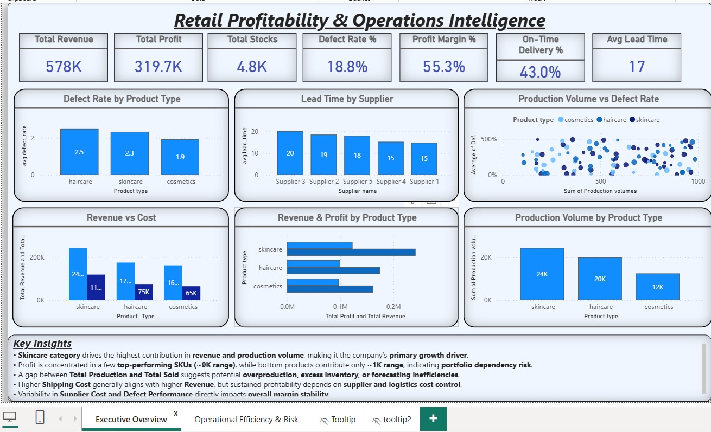

## 📦 Retail Operations & Profitability Analysis (Power BI)

### 🔍 Project Overview

This project analyzes retail operations and profitability by combining supply chain, inventory, and sales data. The objective is to identify key drivers of revenue, cost inefficiencies, supplier performance, and operational risks using an interactive Power BI dashboard.

---

### 📁 Dataset Description

The dataset includes end-to-end retail and supply chain data:

* Product details (Product Type, SKU, Price)
* Sales & Profit (Revenue, Profit, Quantity Sold)
* Inventory (Stock Levels, Availability, Turnover)
* Logistics (Shipping Time, Shipping Cost, Carriers)
* Supplier Data (Lead Time, Cost per Unit, Defect Rate)
* Manufacturing (Production Volume, Manufacturing Cost)

---

### 🎯 Key Business Objectives

* Analyze revenue and profit contribution by product categories
* Identify operational inefficiencies in inventory and production
* Evaluate supplier performance and quality risks
* Analyze logistics cost vs revenue impact
* Detect risks in lead time, defects, and cost variability

---

### 📊 Dashboard Features

* KPI cards:

  * Total Revenue
  * Total Profit
  * Profit Margin %
  * Defect Rate %
  * On-Time Delivery %
  * Average Lead Time

* Visualizations:

  * Revenue vs Cost Analysis
  * Profit by Product Type
  * Production Volume vs Defect Rate
  * Supplier Performance Matrix
  * Shipping Cost vs Revenue
  * Inventory Turnover Analysis

---

### 💡 Key Insights

* Skincare category is the primary revenue and production driver
* Profit is concentrated among a few top-performing SKUs, indicating portfolio dependency risk
* High shipping costs do not always translate into higher revenue, revealing cost inefficiencies
* Suppliers with high defect rates also show higher cost per unit, increasing margin risk
* Longer lead times contribute to inventory and delivery inefficiencies

---

### 🛠️ Tools Used

* Power BI
* Data Modeling & Visualization
* Business Analysis

---

### 📂 Files

* `dashboard/Retail_Operations_Analysis.pbix` – Power BI dashboard
* `screenshots/retail_dashboard.png` – Dashboard preview

---

### 📸 Project Preview

---

### 👨‍💻 Author

Guneet Kapoor
Aspiring Data Analyst | Power BI | SQL
## 📦 Supply Chain Analysis (Power BI)

### 🔍 Project Overview

This project focuses on analyzing supply chain data to identify inefficiencies, optimize operations, and improve business performance. Using Power BI, an interactive dashboard was created to monitor key metrics such as inventory levels, supplier performance, logistics efficiency, and cost distribution.

---

### 📁 Dataset Description

The dataset contains detailed supply chain information including:

* Product details (Product Type, SKU, Price)
* Sales & Revenue (Units Sold, Revenue Generated)
* Inventory (Stock Levels, Availability)
* Logistics (Shipping Times, Carriers, Costs, Routes)
* Supplier Information (Supplier Name, Location, Lead Time)
* Manufacturing (Production Volume, Manufacturing Costs, Defect Rates)

---

### 🎯 Key Business Objectives

* Analyze product performance and revenue contribution
* Monitor stock levels and identify inventory risks
* Evaluate supplier efficiency and lead times
* Analyze shipping performance and transportation costs
* Identify key factors impacting supply chain efficiency

---

### 📊 Dashboard Features

* Interactive filters (Product Type, Supplier, Location)
* KPI cards:

  * Total Revenue
  * Total Units Sold
  * Average Lead Time
  * Total Shipping Cost
* Visualizations:

  * Revenue by Product Type
  * Stock Level vs Demand
  * Supplier Performance Analysis
  * Shipping Cost & Time Analysis
  * Defect Rate & Quality Insights

---

### 💡 Key Insights

* High-revenue products often face stock shortages
* Longer lead times negatively impact product availability
* Shipping costs vary significantly across transportation modes
* Some suppliers show higher defect rates affecting product quality

---

### 🛠️ Tools Used

* Power BI
* Excel / Database

---

### 📂 Files

* `dashboard/Supply_Chain_Analysis.pbix` – Power BI dashboard file
* `screenshots/supply_chain_dashboard.png` – Dashboard preview

---

### 📸 Project Preview

---

### 👨‍💻 Author

Pragati Nashine
Data Analyst | Power BI | SQL
